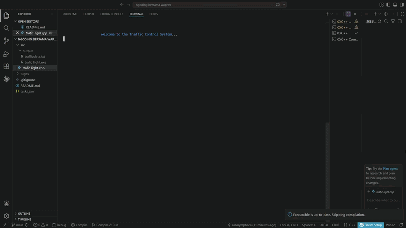

# Traffic Light Simulation System


---

## 📌 Overview

A console-based traffic light simulation system built using C++ to demonstrate structured programming and system modeling.

The system simulates a cyclic traffic light controller with three states: **Red**, **Yellow**, and **Green**.

---

## 🎯 Objectives

- Implement sequential control system in C++
- Simulate real-world traffic light behavior using state machine design
- Practice structured and object-oriented programming (OOP)
- Use Git & GitHub workflow properly
- Build a clean engineering-style project structure

---

## 🏗️ System Architecture

The system follows a simple cyclic state machine:

```
RED (STOP) → YELLOW (PREPARE) → GREEN (GO) → LOOP
```

---

## 📊 Flowchart

Flowchart sistem traffic light:



---

## 🎞️ Simulation Demo

Simulasi program console:



---

## 💻 Implementation (C++)

```cpp
#include <iostream>
#include <thread>
#include <chrono>

using namespace std;

class TrafficLight {
private:
    string state;

    void delay(int seconds) {
        this_thread::sleep_for(chrono::seconds(seconds));
    }

public:
    void setRed() {
        state = "RED";
        cout << "[RED]    STOP VEHICLES" << endl;
        delay(2);
    }

    void setYellow() {
        state = "YELLOW";
        cout << "[YELLOW] PREPARE" << endl;
        delay(1);
    }

    void setGreen() {
        state = "GREEN";
        cout << "[GREEN]  GO" << endl;
        delay(2);
    }

    void run() {
        while (true) {
            setRed();
            setYellow();
            setGreen();
        }
    }
};

int main() {
    TrafficLight system;
    system.run();
    return 0;
}
```

---

## 📁 Project Structure

```
traffic-light-system/
│
├── assets/
│   ├── traffic_light_flowchart.svg
│   └── traffic-light.gif
│
├── src/
│   └── traffic_light.cpp
│
├── README.md
└── .gitignore
```

---

## ⚙️ Build & Run

### Compile

```bash
g++ src/traffic_light.cpp -o traffic_light -std=c++17
```

### Run — Windows

```bash
traffic_light.exe
```

### Run — Linux / macOS

```bash
./traffic_light
```

---

## 👨‍🏫 Lecturers

| No | Name |
|----|------|
| 1  | Dr. Darmawan, S.T., M.Sc |
| 2  | Amirul Luthfi, S.T., M.T |

---

## 👥 Group Members

| No | Name | NIM |
|----|------|-----|
| 1  | Ahmad Adzani Gibran  | 2510953018 |
| 2  | Faruq Habibi         | 2510953014 |
| 3  | Rangga Pramudya      | 2510953038 |
| 4  | Nabila Nasywa Putri  | 2510953030 |

---

## 🧠 Learning Outcomes

- State machine implementation in C++
- Real-time simulation logic using `<chrono>` and `<thread>`
- Clean OOP design and encapsulation
- Git & GitHub workflow
- System modeling basics

---

## 🏁 Conclusion

This project demonstrates a structured engineering approach to simulating a traffic light system using C++. It serves as a foundation for understanding control systems and software design principles.

---

## 👨‍💻 Author

**Student Project — Pemrograman 2**  
GitHub: [https://github.com/rannymphaea](https://github.com/rannymphaea)
